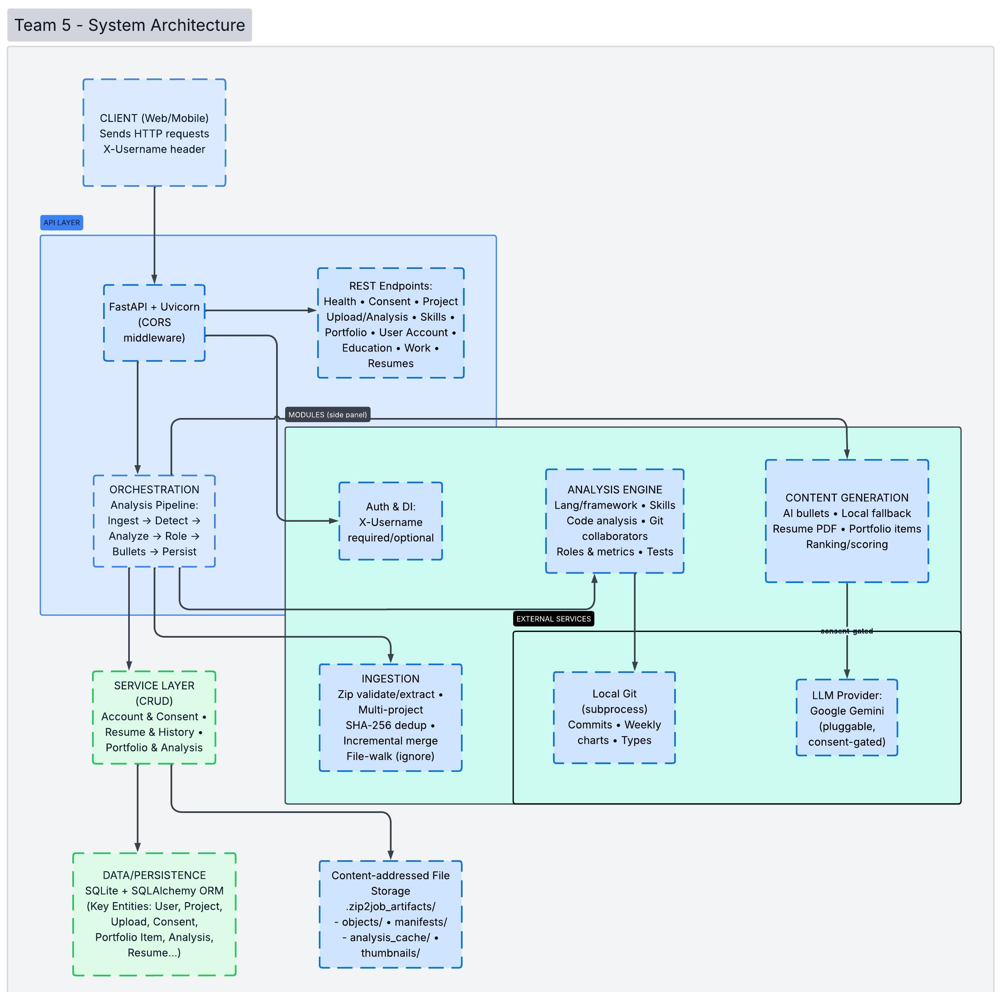
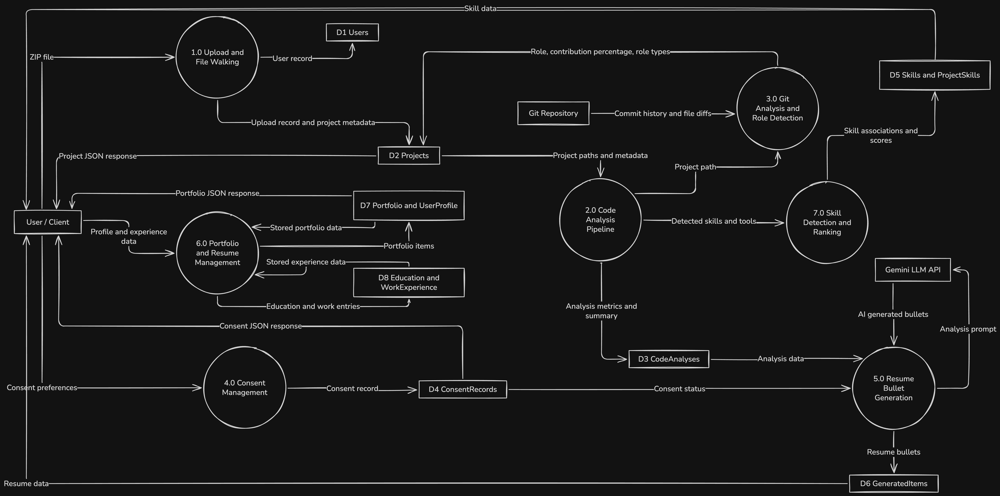

[](https://classroom.github.com/online_ide?assignment_repo_id=20510514&assignment_repo_type=AssignmentRepo)

# Zip2Job

An application that analyzes code repositories, extracts developer skills, detects roles, and generates tailored portfolios and resumes with optional AI enhancement.

**Tech stack:** Electron + React frontend, FastAPI backend, SQLite database, Gemini AI integration.

---

## Documentation

| Document | Description |
|----------|-------------|
| [Installation Guide](docs/INSTALLATION.md) | Prerequisites, setup steps for backend and frontend, environment variables, and how to run the application |
| [Test Report](docs/TEST_REPORT.md) | Complete list of all test files, testing strategies used (API integration, unit, mocking, DOM/component), and test infrastructure details |

---

## Project Structure

```
.
├── src/capstone_project_team_5/   # Python backend
│   ├── api/                       # FastAPI app
│   │   ├── main.py                # App entrypoint
│   │   ├── routes/                # HTTP route handlers
│   │   ├── schemas/               # Pydantic request/response models
│   │   └── dependencies.py        # JWT auth dependency
│   ├── services/                  # Business logic layer
│   ├── data/                      # Database layer
│   │   ├── db.py                  # SQLAlchemy session management
│   │   └── models/                # ORM table definitions
│   ├── python_analyzer.py         # Python AST analysis
│   ├── js_code_analyzer.py        # JavaScript/TypeScript analysis
│   ├── java_analyzer.py           # Java analysis (tree-sitter)
│   └── c_analyzer.py              # C/C++ analysis (tree-sitter)
├── frontend/                      # Electron + React frontend
│   ├── src/main.js                # Electron main process
│   ├── renderer/src/              # React app (Vite-served)
│   │   ├── app/context/           # Global state (AppContext)
│   │   ├── app/navigation/        # Page routing (pageRegistry)
│   │   ├── pages/                 # Page components
│   │   └── lib/                   # Utility functions
│   └── tests/                     # Frontend Jest tests
├── tests/                         # Backend pytest tests
├── docs/                          # Documentation, logs, design
├── pyproject.toml                 # Python project config
└── .env.example                   # Environment variable template
```

---

## Test Data

Three test-data ZIP files are located in the **repository root**:

| File | Description |
|---|---|
| `test-data.zip` | Multi-project showcase containing individual and collaborative projects (code, text, image, and mixed) |
| `test-data-v1.zip` | Earlier snapshot of `code_collab_proj` (7 files — basic app, one test, initial docs) |
| `test-data-v2.zip` | Later snapshot of `code_collab_proj` (11 files — added endpoints, more tests, updated docs) |

Upload `test-data-v1.zip` first, then `test-data-v2.zip` to test incremental uploads.

---

## System Design

### System Architecture Diagram


### M2 System Architecture Diagram


---

### Data Flow Diagram


### M2 Data Flow Diagram


---

### Work Breakdown Structure


---

### Team Contract

https://github.com/COSC-499-W2025/capstone-project-team-5/blob/team-contract/docs/contract/Capstone%20Team%205%20Contract.pdf
