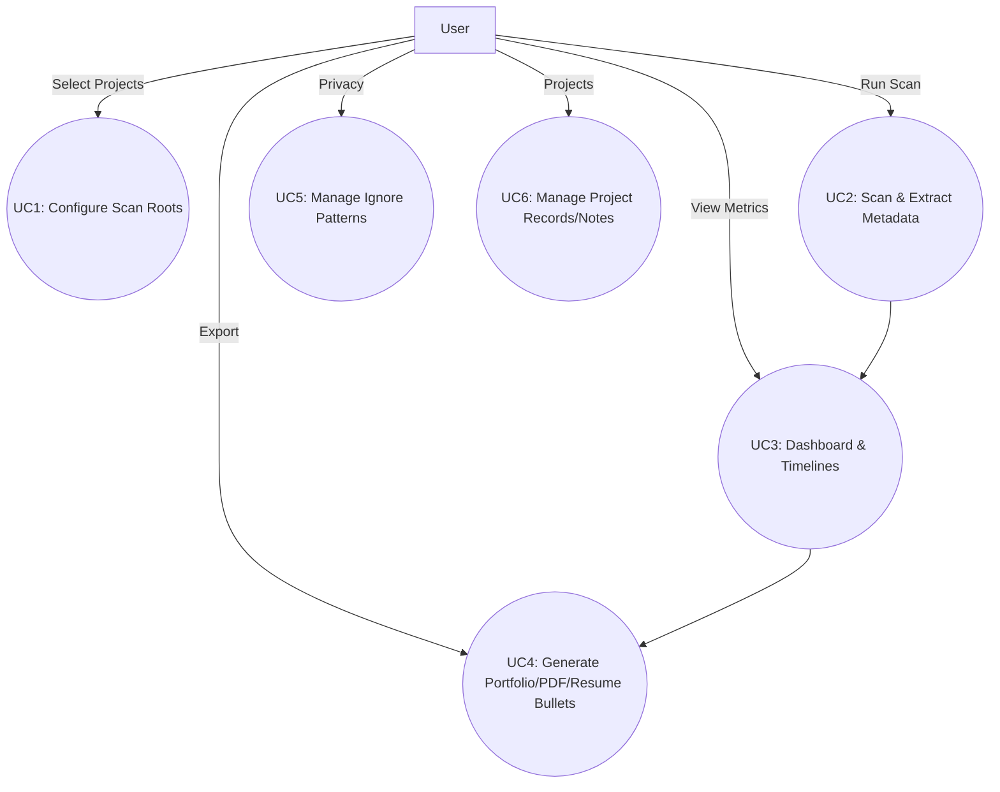

# Features Proposal for Mining Digital Work Artifacts

**Team Number:** Group 05  
**Team Members:** Sparsh Khanna, Ojus Sharma, Ribhav Sharma, Ronit Buti (80223837), Ethan Methorst, Chris Hill

---

## 1. Project Scope and Usage Scenario

This project mines a user’s local digital work artifacts—code repositories, documents, and media—to surface meaningful insights about their professional and creative output. Primary users include graduating students, early‑career professionals, freelancers/creators, and managers seeking per‑project contribution reports. Core scenarios span portfolio creation, résumé enhancement, self‑reflection/productivity tracking, interview support, and impact measurement (e.g., commit activity, document counts, language mix). The app runs fully **locally** for privacy, scanning only selected directories and respecting user‑defined ignore rules.

## 2. Proposed Solution

A cross‑platform desktop app (Windows/macOS/Linux) that lets users select project roots (folders or Git repos) to scan. The scanner extracts metadata (timestamps, authorship, file types, version history where available) across artifact types and computes metrics (commit frequency, document/word counts, media dimensions). Artifacts are grouped by project to keep portfolios tidy. A dashboard provides charts/timelines for evolution and usage patterns, and creators export portfolio pages, PDFs, and concise résumé bullets. Privacy is preserved by default: data never leaves the machine and users can exclude sensitive files via patterns.
  
**Interesting/Unique:**  
- Automated project grouping from directory/repo structure.  
- Combined **reflection** (timelines/metrics) and **presentation** (exports) workflows.  
- Git‑style ignore controls for sensitive files.  
- Fast incremental scans (only new/changed files).

**Technology Stack (local‑first):**  
- **Languages:** Python, TypeScript  
- **Desktop:** Tauri
- **DB/ORM:** SQLite + SQLAlchemy (Python)  
- **Scanning/Extraction:** Watchdog (FS), GitPython (Git), python‑docx/textract, cloc/pygount, ffprobe/ExifRead for media, regex/NLP (re, spaCy/NLTK)  
- **Analytics:** pandas, numpy, collections  
- **Visualization:** d3, Recharts  
- **Export:** Markdown/HTML, PDF generation  
- **Testing:** PyTest/pytest‑cov (Python), Playwright + React Testing Library + Vitest

## 3. Use Cases

**Use Case 1: Configure Scan Roots**  
- *Primary actor:* User  
- *Description:* Choose folders/repos to include; set labels and scan rules.  
- *Precondition:* App installed and opened.  
- *Postcondition:* Roots saved to DB; ready for a scan.  
- *Main Scenario:* 1) Open Settings → Projects; 2) Add folder/repo; 3) (Optional) name/label; 4) Save.  
- *Extensions:* E1. Invalid path → show error; E2. Duplicate path → ignore with notice.

**Use Case 2: Scan & Extract Metadata**  
- *Primary actor:* User  
- *Description:* Run a scan to index files and collect metadata (incl. Git history when available).  
- *Precondition:* At least one root configured.  
- *Postcondition:* Artifacts indexed with metadata & metrics cached.  
- *Main Scenario:* 1) Click “Scan”; 2) Watchdog walks roots; 3) For each artifact type, extractor parses metadata; 4) Git repos parsed with GitPython; 5) Cache to SQLite.  
- *Extensions:* E1. Permission error → skip & log; E2. Unsupported file type → skip & log; E3. Incremental scan only changed files.

**Use Case 3: Dashboard & Timelines**  
- *Primary actor:* User  
- *Description:* Explore charts (commit frequency, language/doc mix, media stats) and timelines by project.  
- *Precondition:* Scan completed.  
- *Postcondition:* None (read‑only views).  
- *Main Scenario:* 1) Open Dashboard; 2) Filter by project/date/type; 3) Inspect charts/tables; 4) Drill‑down to files/commits.  
- *Extensions:* E1. No data → show empty state & tips; E2. Large dataset → paginate/virtualize.

**Use Case 4: Generate Portfolio/PDF/Resume Bullets**  
- *Primary actor:* User  
- *Description:* Create exports (Markdown/HTML/PDF) and résumé bullets using computed metrics.  
- *Precondition:* Scan completed.  
- *Postcondition:* Files written to chosen location.  
- *Main Scenario:* 1) Choose Export; 2) Pick format(s) & template; 3) Preview; 4) Generate; 5) Save to disk.  
- *Extensions:* E1. Missing dependencies (e.g., wkhtmltopdf) → prompt install; E2. Invalid path → retry selector.

**Use Case 5: Manage Ignore Patterns**  
- *Primary actor:* User  
- *Description:* Add patterns (like `.gitignore`) to exclude files/folders from scans/exports.  
- *Precondition:* At least one root configured.  
- *Postcondition:* Ignore rules stored and enforced on next scan.  
- *Main Scenario:* 1) Open “Privacy”; 2) Add patterns; 3) Save; 4) Re‑scan.  
- *Extensions:* E1. Pattern excludes everything → warning; E2. Conflicting rules → highest‑priority rule wins.

**Use Case 6: Manage Project Records/Notes**  
- *Primary actor:* User  
- *Description:* Store per‑project metadata (title, tags, notes) that influence grouping and exports.  
- *Precondition:* App installed.  
- *Postcondition:* Project records persisted.  
- *Main Scenario:* 1) Open Projects; 2) Add/edit metadata; 3) Save.  
- *Extensions:* E1. Duplicate titles → show suffix; E2. Delete record → require confirm.

## 4. Requirements, Testing, Requirement Verification

**Stack & Test Frameworks:** Python + TypeScript; PyTest (unit/integration), Playwright + RTL + Vitest (UI/E2E).

| # | Requirement (Functional unless noted) | Test Cases (positive & negative) | Who | H/M/E |
|---|---------------------------------------|----------------------------------|-----|-------|
| 1 | Select specific directories/repos for scanning | TC1.1: User selects one or more directories/repos. Only the chosen paths are scanned. Verify that no files outside selected paths are processed. | Ronit | M |
| 2 | Support artifact types: Git, documents (Word/PDF/MD), media (images/video/design) | TC2.1: Pass a mixed set of files with supported and unsupported extensions. Supported files are scanned, unsupported files are rejected or ignored. | Sparsh | H |
| 3 | Extract metadata: timestamps, authorship, file type, version history (if available) | TC3.1: Scan a sample selection of files (code, documents, media). Verify that extracted metadata includes timestamp, author, file type, and version history where applicable. | Ethan | E |
| 4 | Compute metrics: commit freq, doc/word counts, media dims (res, size, frame rate) | TC4.1: Run metrics computation on a known sample dataset. Verify that computed commit counts, word counts, media dimensions, etc., match expected values. | Chris, Ethan | H |
| 5 | Group artifacts by project (repo or root directory) | TC5.1: Scan multiple repositories/root directories. Verify each artifact is correctly grouped under its respective project and no duplicates exist. | Ojus, Ronit | E |
| 6 | Generate visualizations & text summaries (charts/timelines/dashboards) | TC6.1: Generate charts and timelines for a sample dataset. Verify that plotted data points and summaries accurately reflect the underlying metrics. | Ribhav | M |
| 7 | Export to HTML/MD/PDF incl. résumé bullets | TC7.1: Export a summary in HTML, Markdown, and PDF. Verify each format contains identical sections, results, and metrics, correctly formatted. | Ojus | M |
| 8 | Ignore patterns to exclude files from analysis | TC8.1: Confirm ignored files do not appear in the results, while non-ignored files are included. | Ribhav | M |
| 9 | Store user/project metadata in DB (title/tags/notes) | TC9.1: Create or define a project with user metadata (e.g., project name, description). Verify that metadata is saved and retrievable after scanning and analysis. | Chris | E |
**Non‑Functional Requirements (and tests):**  
- Cross‑platform (Win/Linux/macOS): run same scans/exports → identical outputs; app starts without errors.  
- Performance: baseline scan ≥1,000 files in ~10 minutes on reference machine; incremental scans update only changed files.  
- Security/Privacy: data stays local by default; manual QA verifies no network calls; ignores respected.  
- Usability: dashboard clarity/accessibility checks; keyboard navigation & focus states verified in UI tests; empty state guidance.  
- API (later): local REST endpoints for metrics/insights (to support future Term‑2 FE/API).

---

### Traceability: Use Cases → Requirements
- UC1 → R1, R9
- UC2 → R2, R3, R4, R8
- UC3 → R4, R6
- UC4 → R6, R7, R9
- UC5 → R8
- UC6 → R9

### Milestone‑Ready Deliverables (Term 1)
- Local scanner + metadata extractors (Git/docs/media) with incremental scanning
- SQLite schema + project records
- Dashboard MVP (charts, filters) + export (MD/HTML/PDF) + résumé bullets
- Ignore patterns UI + tests (unit, integration, E2E)

