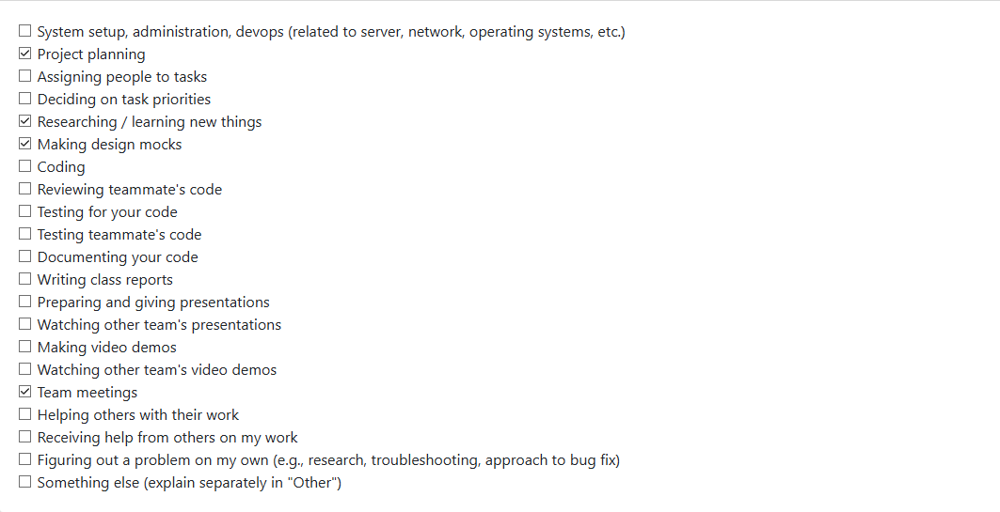
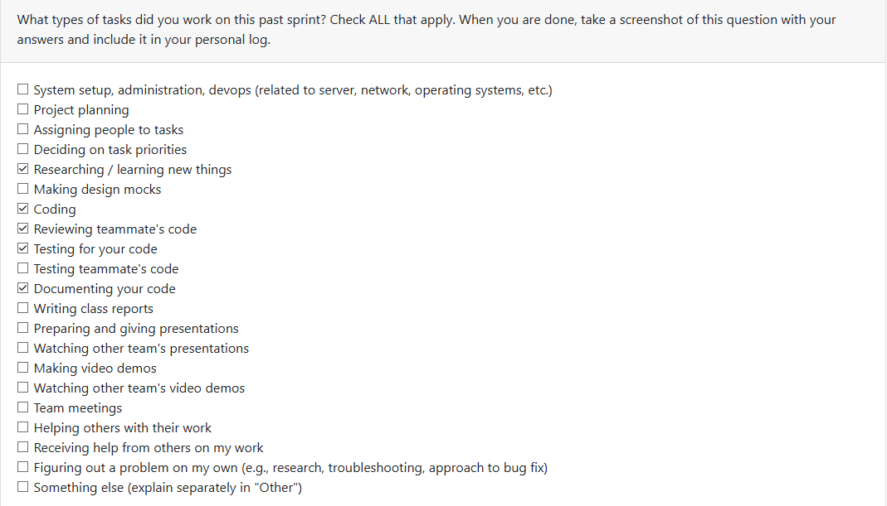
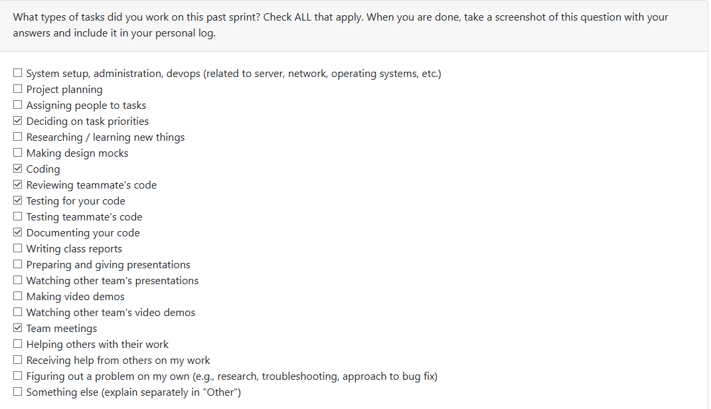
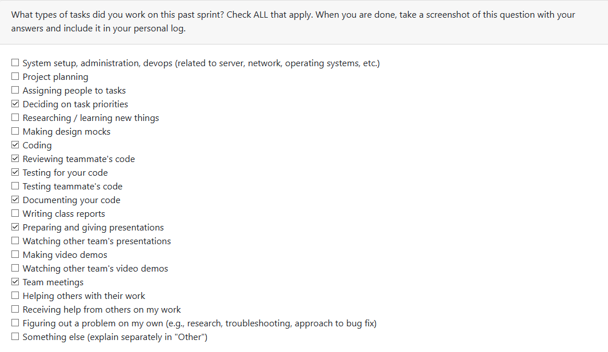
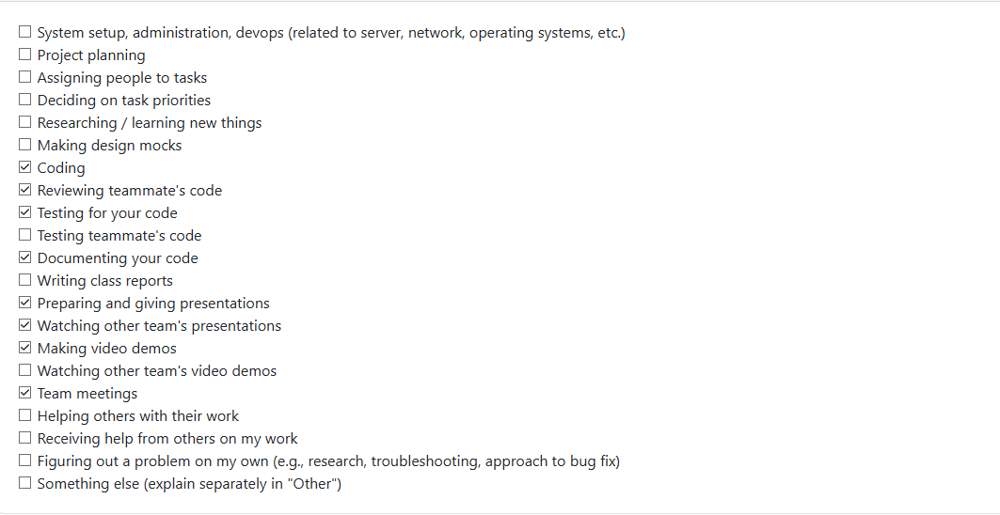

## Week #3 (14 September 2025 - 21 September 2025)

Time was spent creating the requirements and planning the project at a high level. My effort involved re-writing all of our initial requirements after meeting with the other teams and spending more time thinking about what our project should do.

## Week #4 (September 21-28 2025)

Early in the week time was spent refactoring our system architecture diagram after meeting with other teams and getting feedback. Later in the week time was spent working on the project proposal, where I outlined our scope and target users, proposed solution and interesting / unique features, as well writing out our functional requirements with minor refactoring from previous.

## Week #5 (September 28 - October 5 2025)

Time was spent working on the level 1 data flow diagram. Our intial draft that was brought to class was refactored in whole to include more accurate components as well as attempting to improve readability. Because this was all that was needed for the week team meetings were limited and no other descion making was involved. The plan for the next cycle is to revisit our requirements and finalize them to help our final system architecture diagram.

## Week #6 (Oct 6 - 7 2025)

In the past cycle most of the time was spent on team meetings assinging people to tasks for the revised work breakdown structure. Time was also spent getting started on code contributions as well as the initial project environment setup. The plan for next sprint is to develop a timeline to follow that can guide us to what requirements we need to be working on first, as well as having concrete code contriubtions for these requirments. 

| Task  | Status | Notes |
| :---- | :------:| -------: |
| User Config | In progress     | Task is being planned and minimal code contributions have been made this sprint.|

## Week #7 (October 13 - 19)

Time this week was spent coding, finishing a minor feature. No team meetings took place this week due to everyone busy with midterms. Looking to get back on track next week meeting with the team.

| Task  | Status | Notes |
| :---- | :------:| -------: |
| User Config | In progress     | Feature is mostly complete with room for it to be extended to in the future. |

## Week #8 (October 20 - 26)

Time this week was spent coding, creating a new feature for collaborative project detection (requirement #7). The plan for next week is to look back and refactor any previous features that need updating as well as continuing to go down the list of requirements as planned. Next sprint starting requirement #10 extracting key contribution metrics.

| Task  | Status | Notes |
| :---- | :------:| -------: |
| Project Collaboration Detection | In progress | Feature is mostly complete with room for it to be refactored depending on needed implementation. |

## Week #9 (October 27 - November 2)

Time this week was spent coding a new feature for extracting key contrtibution metrics from a project (requirement #10). The feature is complete and ready to be merged. As all assigned requirements are completed next week will be spent refactoring previous work and integrating all features into the main program.

| Task  | Status | Notes |
| :---- | :------:| -------: |
| Key Contribution Metrics | Completed | Feature is complete and approved ready to be merged. |
| Refactoring| In progress | Refactoring any part of code base where it is needed. |

## Week #10 (November 3 - November 9)

This week time was spent in team meetings on monday discussing what is needed going forward as well as coding. Some features from previous weeks were not yet implemented in the main program. This week I refactored contribution metrics and collaboration detection features and added them into the main program. Next week is reading week so I don't know the exact plans for this next sprint.

| Task  | Status | Notes |
| :---- | :------:| -------: |
| Refactoring| Done | Refactored previous features and added to main program CLI. |

## Week #12 (November 17 - November 23)

This week time was spenting coding specific analysis for each major programming language to deepen our project analysis insights. I worked on JavaScript / TypeScript projects. The feature is complete. Next sprint time will be spent refactoring and making sure that all is met for the upcoming milestone.

| Task  | Status | Notes |
| :---- | :------:| -------: |
| JS/TS | Done | JS/TS project analysis to create resume-relevant insights. |

## Week #13 (November 24 - November 30)

This week time was spent integrating past JS/TS specific language analysis feature. The feature is fully integated into the project flow, matching the unified programming language analysis output class as well as specific local bullet point generation for JS/TS projects. Time was spent outlining the presentation and creating slides. The plan for next sprint is to cleanup any lose ends to have all requirements completed for video demo / checklist.

| Task  | Status | Notes |
| :---- | :------:| -------: |
| JS/TS Integration | Done | Fully integrated into project flow. |

## Week #14 (December 1 - December 7)

Time this week was spent presenting in class on monday as well as creating the team contract and completing most of the required fields. Code contributions included enhancing previous JavaScript / TypeScript code analysis using AST analysis. This included updating the local JS bullet point generation to reflect the new analysis.

| Task  | Status | Notes |
| :---- | :------:| -------: |
| JS/TS AST Analysis | Done | Fully integrated into project flow. |

## Term 2 - Week #1 (January 05 - 11)

This week some members were travelling so no formal meetings took place. This week time was spent starting milestone 2 requirements. Code contributions this week included saving the user edits to portfolio items to the db and retreiving these items for the user if present. The plan for next sprint is to meet with the whole team and get on track for milestone 2.

| Task  | Status | Notes |
| :---- | :------:| -------: |
| Saver user edits | Done | Allows for user edits to output to be saved as a portfolio item. |    

## Term 2 - Week #2 (January 12 - 18)

This week time was spent meeting with team members in class on monday discussing our plan for milestone 2 and dividing up milestone requirements. Time coding was spent creating backend functionality for storing user resume specific information. The plan for next week is to keep going on milestone 2 requirements and plan for peer testing. 

| Task  | Status | Notes |
| :---- | :------:| -------: |
| Resume Services | Done | Comphrehensive functionality for saving, reading, updating and deleting user resume items. |    

## Term 2 - Week #3 (January 19 - 25)

This week time was spent meeting with team members in class on monday discussing our plan for peer testing and upcoming milestone work. A list of tasks and a small questionaire for peer testing was put together this week. Code contributions including aggregating a users skills accross all their projects sorted chronologically.

| Task  | Status | Notes |
| :---- | :------:| -------: |
| Aggregated Skills | Done | Service completed, will add to TUI after peer testing. |    

