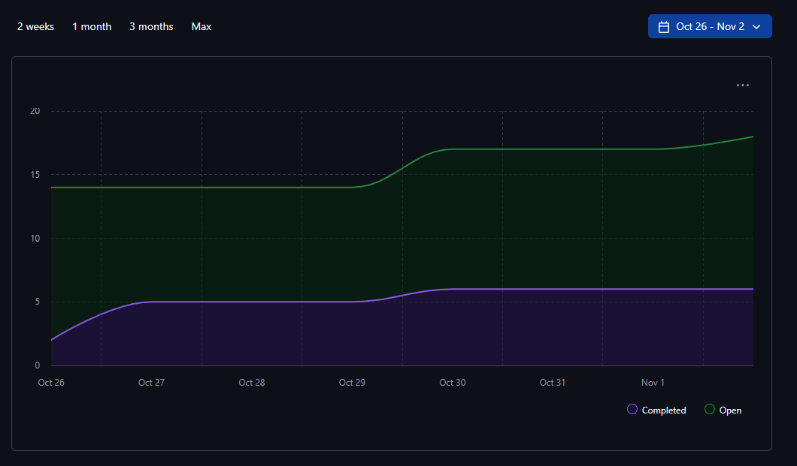

# Team Weekly Logs

  
<h3>T2 Week 4,5 | January 26 - Feb 8 </h3>

  ### Burnup Chart

  ### Past Work
- [PR #270 - Aggregated skills display.](https://github.com/COSC-499-W2025/capstone-project-team-5/pull/270): Displays aggregated user skills on the TUI for improved visibility of skill data across projects.
- [PR #271 - feat: Replace project thumbnail URL with image upload](https://github.com/COSC-499-W2025/capstone-project-team-5/pull/271): Replaced project thumbnail URL input with direct image upload functionality for a more seamless user experience.
- [PR #272 - Consent tool refinements](https://github.com/COSC-499-W2025/capstone-project-team-5/pull/272): Refined the consent tool with UX and functionality improvements for better data consent management.
- [PR #273 - User role api](https://github.com/COSC-499-W2025/capstone-project-team-5/pull/273): Added user role API endpoints with bug fixes and enhancements for role-based access control.
- [PR #275 - feat: added configuration + PT1 minor ux fixes](https://github.com/COSC-499-W2025/capstone-project-team-5/pull/275): Added configuration support and minor UX fixes for Part 1 of the application.
- [PR #276 - Add UserProfile, WorkExperience & Education Tables to Schema](https://github.com/COSC-499-W2025/capstone-project-team-5/pull/276): Added new database schema tables for UserProfile, WorkExperience, and Education to support resume generation features.
- [PR #283 - feat: add `/config/score` endpoint](https://github.com/COSC-499-W2025/capstone-project-team-5/pull/283): Added a new `/config/score` API endpoint for scoring configuration management.
- [PR #290 - Resume Generator: Add User Info CRUD](https://github.com/COSC-499-W2025/capstone-project-team-5/pull/290): Introduced a UserProfileService with full CRUD operations for managing user contact and personal information for resume generation.
- [PR #291 - Resume Generator: Work Exp CRUD](https://github.com/COSC-499-W2025/capstone-project-team-5/pull/291): Implemented CRUD services for work experience data as the foundation for resume generation.
- [PR #292 - Resume Generator: Education CRUD](https://github.com/COSC-499-W2025/capstone-project-team-5/pull/292): Implemented a complete Education CRUD service with comprehensive validation logic for managing user educational history.
- [PR #293 - feat: add `/portfolio` endpoints (crud)](https://github.com/COSC-499-W2025/capstone-project-team-5/pull/293): Introduced first-class portfolio endpoints allowing users to create named portfolios, attach projects, and edit narratives.
- [PR #295 - Implement Scroll on Side Panel](https://github.com/COSC-499-W2025/capstone-project-team-5/pull/295): Changed the left panel container to VerticalScroll for better UX and to support future expansion of functionality.
- [PR #297 - feat(api: incremental uploads, content dedupe, fingerprint cache](https://github.com/COSC-499-W2025/capstone-project-team-5/pull/297): Added API support for incremental uploads, content-based file deduplication, merged analysis, and fingerprint caching for performance.
- [PR #298 - Expand r24](https://github.com/COSC-499-W2025/capstone-project-team-5/pull/298): Enhanced the user role detection system with role justification explanations and a refined role taxonomy with more granular classification.
- [PR #300 - Project chronology tracking.](https://github.com/COSC-499-W2025/capstone-project-team-5/pull/300): Introduced start/end date chronology tracking for projects with TUI rendering and editing support.
- [PR #303 - FEAT:Project rerank](https://github.com/COSC-499-W2025/capstone-project-team-5/pull/303): Added a new batch reranking API endpoint (`/api/projects/rerank`) for updating importance ranks of multiple projects in a single operation.

  ### Updates on Previous To-Do's
  | Task | Status | Notes |
  | --- | --- | --- |
  | Complete PR testing| ✅ Done | Successful completion of session |
  | Discuss Peer feedback | ✅ Done | Created issues based on peer feedback (w ronit) |
  | Implement feedback issue fixes | ✅ Done | Completed quite a few fixes. Continuous process. |
  | Handle edge cases in endpoints  | ❌ In Progress | Worked on new endpoints. Will be addressed. |
  | Continue with Milestone #2 requirements| ✅ Done | Continuous process.|
  
  ### Future Work
  - Continue with Milestone 2 requirements
  - Discuss remaining endpoints to be implemented

  
<h3>T2 Week 3 | January 19 - January 23 </h3>

  ### Burnup Chart

  ### Past Work
  - [Added endpoints for editing portfolios](https://github.com/COSC-499-W2025/capstone-project-team-5/pull/256)
  - [Improvements for R22, with hashing and added validation.](https://github.com/COSC-499-W2025/capstone-project-team-5/pull/250)
  - [[BIG] FILE EXPORTS!!! ](https://github.com/COSC-499-W2025/capstone-project-team-5/pull/257)
  - [Skills development over time, now aggregated!!!](https://github.com/COSC-499-W2025/capstone-project-team-5/pull/252)
  - [Project analysis endpoints WITH zip storage.](https://github.com/COSC-499-W2025/capstone-project-team-5/pull/251)
  - [Consent Tool API endpoints](https://github.com/COSC-499-W2025/capstone-project-team-5/pull/248)

  ### Updates on Previous To-Do's
  | Task | Status | Notes |
  | --- | --- | --- |
  | Prepare for Peer Testing | ✅ Done | Questionnaire prepared and Task List complete |
  | Continue with Milestone #2 requirements| ✅ Done | Continuous process.|
  | Decide on Improvements to be Implemented | ❌ In Progress | Doing some refactoring / improvements of past work. Continuous process. |
  
  ### Future Work
  - Continue with Milestone 2 requirements
  - Participate in Peer Testing, and incorporate feedback.
  - Handling edge cases and ensure holistic integration when working with endpoints.

  
<h3>T2 Week 2 | January 12 - January 18 </h3>

  ### Burnup Chart
  

  ### Past Work
  - Work towards milestone 2 requirements such as
  - User role detection
  - Recognizing duplicate files
  - Saving user resume items
  - API routes for all available CRUD endpoints we have at this time
  - Adding project thumbnail support

  ### Updates on Previous To-Do's
  | Task | Status | Notes |
  | --- | --- | --- |
  | Discuss and Create WBS for Milestone #2 | ✅ Done | Requirements added as GitHub issues and self assigned. |
  | Decide on Improvements to be Implemented | ❌ In Progress | Doing some refactoring / improvements of past work. Continuous process. |
  
  ### Future Work
  - Continue with Milestone #2 requirements
  - Start to prepare for peer testing
  - Decide on improvements to make from past milestone requirements

  
<h3>T2 Week 1 | January 04 - January 11 </h3>

  ### Burnup Chart

  ### Past Work
  - Reflected on presentation
  - General refactoring
  - Started work on API code
  - Started code for saving portfolio changes to database
  - Started Requirement 21 for Milestone #2

  ### Updates on Previous To-Do's
  | Task | Status | Notes |
  | --- | --- | --- |
  | Review suggestions from Milestone 1 Presentation | ✅ Done | |
  | Decide on Improvements to be Implemented | ❌ Not Done | |
  
  ### Future Work
  - Decide on improvements to be implemented from feedback
  - Discuss and Create WBS for Milestone #2

  
<h3>Week 14 | November 30 - December 07 </h3>

  ### Burnup Chart

  ### Past Work
  - Implemented LLM check in SKill detector
  - Code Cleanup for Consent Tool
  - Conducted in Class Presentation
  - Completed Team contract
  - Completed Video Demo

  ### Updates on Previous To-Do's
  | Task | Status | Notes |
  | --- | --- | --- |
  | Complete video demo for milestone #1 | ✅ Done | |
  | Conduct presentation in class |  ✅ Done | |
  | Finalize milestone #1 submissions |  ✅ Done | |
  
  ### Future Work
  - Review suggestions from milestone 1 presentation
  - Decide on improvements to be implemented and divide work

  
<h3>Week 13 | November 24 - 30</h3>

  ### Burnup Chart
  

  ### Past Work
  - Implemented language-agnostic test analysis pipeline and integrated testing metrics
  - Enhanced and integrated Java, Python, and JS/TS language analyzers into CLI workflow with improved analysis depth
  - Integrated code analysis logic flow and enhanced local resume bullet point generation
  - Improved TUI with project/analysis retrieval features and enhanced UX/flow changes across the application
  - Enhanced code analysis persistence layer with deletion logic and prepared presentation materials for milestone #1

  ### Updates on Previous To-Do's
  | Task | Status | Notes |
  | --- | --- | --- |
  | Integrating All Features | ✅ Done | Major integration work completed - language analyzers, test analysis, TUI features all integrated |
  | Prepare for milestone 1 | 🚧 In Progress | Presentation materials completed, video demo and final submissions pending |

  ### Upcoming Work
  - Complete video demo for milestone #1
  - Finalize milestone #1 submissions (team contract, self-reflection, deliverable, peer evaluation)
  - Conduct presentation in class

  
<h3>Week 12 | November 17 - 23</h3>

  ### Burnup Chart
  

  ### Past Work
  - Implemented deep analysis Java, C, C++, JS, TS, Python.
  - Add project ranking based on user contributions
  - Summarize top ranked projects
  - Update consent tool for integration preparation

  ### Updates on Previous To-Do's
  | Task | Status | Notes |
  | --- | --- | --- |
  | Sync main with Develop |✅ Done | Need to get all PR's merged and sync this week. |
  | Integrating All Features | In Progress | Primary focus for next week.
  | Database | ✅ Done| Database set up and refactors for SQLAlchemy complete. |
  | Refactoring to make codebase cleaner |  ✅ Done| Multiple services refactored. |

  ### Upcoming Work
  - Integrate all features and components, and prepare for milestone 1.

  
<h3>Week 10 | November 3 - 7</h3>

  ### Burnup Chart
  

  ### Past Work
  - Merging develop and sync branches
  - Extracting multiple projects from a single zip file
  - Deletion of portfolio items
  - Refactor to reduce coupling
  - Refactor for sql alchemy 
  - Retrieve previously generated resume item

  ### Updates on Previous To-Do's
  | Task | Status | Notes |
  | --- | --- | --- |
  | Sync main with Develop |✅ Done | Need to get all PR's merged and sync this week. |
  | Integrating All Features | In Progress | Need to integrate all completed features into the main program.
  | Database | ✅ Done| Database set up and refactors for SQLAlchemy complete. |
  | Refactoring to make codebase cleaner |  ✅ Done| Multiple services refactored. |

  ### Upcoming Work
  - Integrate entire end to end flow, including all features.
  - Start exploring deep-analysis, as mentioned in this week's email.

  
<h3>Week 9 | October 27 - November 2</h3>

  ### Burnup Chart
  

  ### Past Work
  - Create Centralized LLM Service 
  - Extract individual contributions from a collaborative project 
  - Deletion of portfolio items
  - Extract key project contribution metrics
  - Refactor for sql alchemy 
  - Detect and persist multiple projects from single ZIP upload

  ### Updates on Previous To-Do's
  | Task | Status | Notes |
  | --- | --- | --- |
  | Sync main with Develop | In Progress | Need to get all PR's merged and sync this week. |
  | Integrating All Features | In Progress | Need to integrate all completed features into the main program.
  | Database | ✅ Done| Database set up and refactors for SQLAlchemy complete. |

  ### Upcoming Work
  - Syncing main with develop needs to be done this upcoming sprint once all PR's are merged.
  - Some features are complete but not involved in the main program. This week all completed features can be implemented in the main program.

  
<h3>Week 8 | October 19-26, 2025</h3>

### Burnup Chart

### Past Work
- Initial Python tooling setup with `uv`, `ruff`, `pytest`
- CI/CD implementation
- Framework/language detection implementation and improvements
- Database and Database Schema Created
- User configuration and consent input features further modified
- Code contributions and PR reviews going as per requirements

### Updates on Previous To-Dos
| Task | Status | Notes |
| --- | --- | --- |
| Retrieve previously generated portfolio (R15) | ✅ Done | Logic staged and to be merged following code review |
| Detect collaborative projects tool | ✅ Done | Logic staged and to be merged following code review|
| Database | in progress | Initial database and schema created; requires monitoring and expansion as needed |

### Upcoming Work
- Sync main branch with develop branch
- Continue integration of modules into larger system
- Database expansion/discussion
- PR reviews and continued code contributions

---

  
<h3>Week 7 | October 12-19, 2025</h3>

### Burnup Chart

### Past Work
- Initial Python tooling setup with `uv`, `ruff`, `pytest`
- CI/CD implementation
- Framework/language detection implementation and improvements
- Database Schema Created
- User configuration and consent input features further modified
- Code contributions and PR reviews going as per requirements

### Updates on Previous To-Dos
| Task | Status | Notes |
| --- | --- | --- |
| Output key project information (R13) | ✅ Done | Logic Staged and to be merged post suggestion changes |
| Framework/language detection | ✅ Done | Initial version merged |
| Database schema | in progress | Initial schema created and updated , still requires further clarity and discussion |
| User configuration | In Progress | More contributions made pending discussion over DB |

### Upcoming Work
- Connecting further modules of our project to test functionality
- Database expansion/ Discussion
- PR reviews and continued code contributions

---

  
<h3>Week 6 | October 6-12, 2025</h3>

### Burnup Chart

### Past Work
- Revised WBS and finalized task distribution; populated Kanban board
- Initial Python tooling setup with `uv`, `ruff`, `pytest`
- Framework/language detection implementation
- Database schema creation
- User configuration and consent input features started
- Code contributions and PR reviews initiated

### Updates on Previous To-Dos
| Task | Status | Notes |
| --- | --- | --- |
| Populate Kanban/task board based on Milestone 1 requirements | ✅ Done | Initial tasks created and distributed |
| Research Python integration with Tauri | ❌ Not Started | Deferred to later in Milestone 1 |
| Framework/language detection | ✅ Done | Initial version merged |
| Database schema | In Progress | Initial schema created |
| User configuration | In Progress | Early contributions made |

### Upcoming Work
- Upload parsing specification and validation
- Artifact extraction research
- Database expansion
- Output key project information (R13)
- PR reviews and continued code contributions

---

  
<h3>Week 5 | September 30-October 4, 2025</h3>

## Milestones
* Completed DFD design and iterated based on internal, external and professor feedback

## What Went Well
* Significantly better communication than last week
* Increased team synergy - members are comfortable sharing opinions 

## What Didn't Go Well
* Ambiguity regarding the level of detail needed in DFD

## Reflection Points
* **Strengths**: Smooth and effective completion of required tasks
* **Areas for Improvement**: Better workload distribution for weekly tasks

## Plan for Next Cycle (Week 6)
* Reviewing finalized set of requirements
* Dividing tasks and responsibilities
* Populating Kanban board
* Researching deeper into finalized tech stack

---

  
<h3>Week 4 | September 22-28, 2025</h3>

## Milestones
* Completed system architecture design and iteration based on class feedback
* Finalized tech stack decisions including Tauri + Python plugin
* Developed project proposal with workload distribution
* Simplified architecture to focus on local implementation

## What Went Well
* Strong collaborative approach to architecture design and tech stack research
* Effective real-time collaboration during project proposal development
* Successful integration of external feedback from class discussions
* Comprehensive research leading to informed technology decisions

## What Didn't Go Well
* Difficulty reaching consensus on cloud vs. local architecture approach
* Poor time management resulting in last-minute preparation before class
* Challenges coordinating meeting times that worked for all members
* Hesitation around major architecture modifications

## Reflection Points
* **Strengths**: Collaborative problem-solving and effective feedback integration
* **Areas for Improvement**: Time management and structured decision-making processes

## Plan for Next Cycle (Week 5)
* Complete Data Flow Diagram early in the week
* Validate Tauri + Python plugin compatibility
* Establish consistent meeting schedule
* Research data mining techniques and Python libraries
* Implement better team coordination for submissions

---

  
<h3>Week 3 | September 15-21, 2025</h3>

## Milestones
* For this milestone, the team met and began discussing, brainstorming, and formulating the Project Requirements.
* Project requirements were re-evaluated after discussions in the classroom with other teams
* Set up the repo structure 

## Team Members:
* Chris Hill - chrishill93
* Ethan Methorst - xvardenx
* Ojus Sharma - ojusharma
* Sparsh Khanna - Sparshkhannaa
* Ribhav Sharma - ribhavsharma
* Ronit Buti - Ron-it

---
