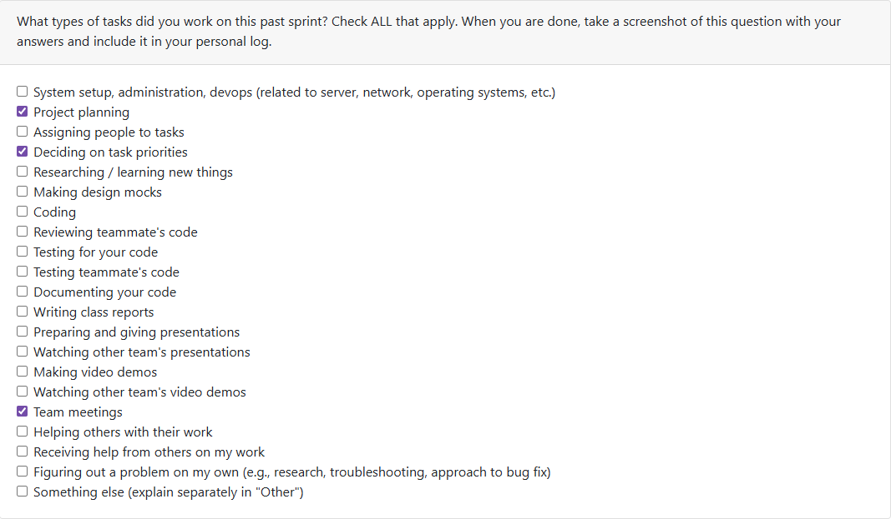

Week #3 (14 September 2025 - 21 September 2025)

This week was fairly light in work, as we were meeting as a team for the first time, and brainstorming Project Requirements. This initial brainstorming was a collaborative effort. My specific contributions were to take the brainstorming notes, and write the foundational functional requirements, in a properly formatted list (i.e "The system shall ... ) in preparation for the class discussions on Wednesday. This was completed in a timely manner.